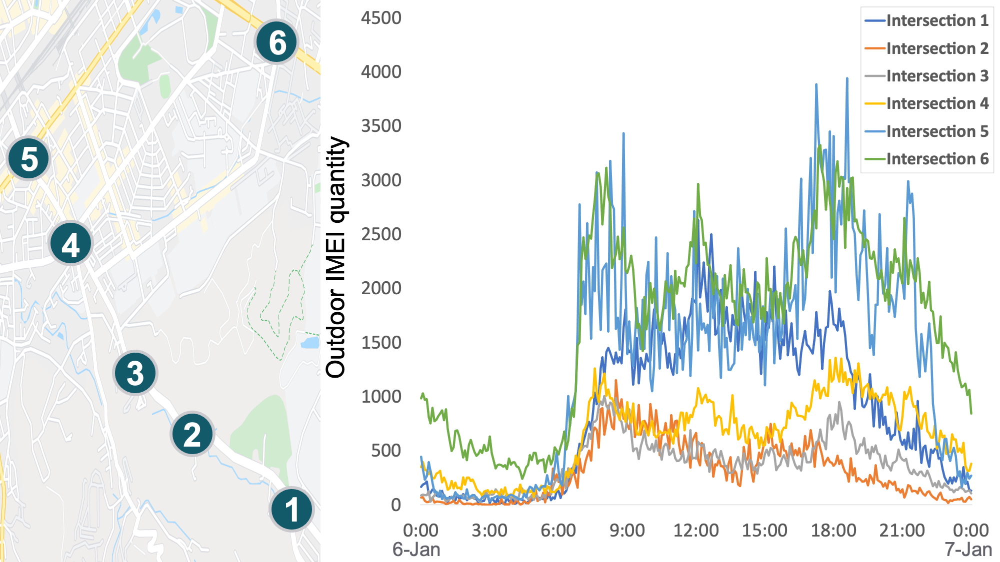
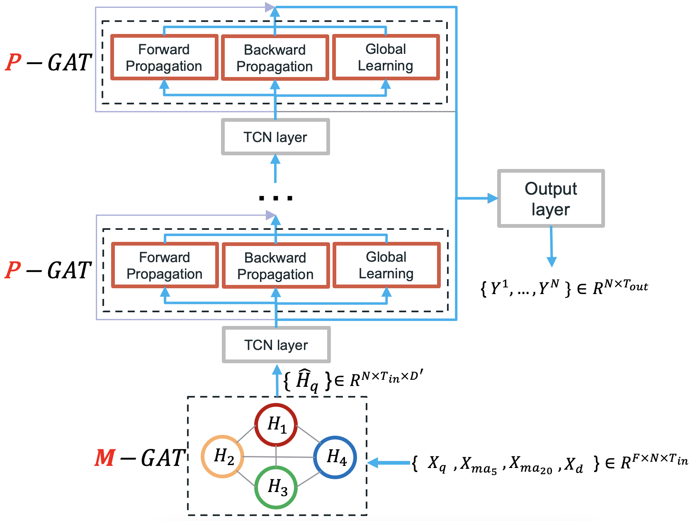

# Multivariate and Propagation Graph Attention Network for Spatial-Temporal Prediction with Outdoor Cellular Traffic

This is the original mobile cellular traffic dataset of MP-GAT in the following paper: 
[Multivariate and Propagation Graph Attention Network for Spatial-Temporal Prediction with Outdoor Cellular Traffic](https://arxiv.org/abs/2108.08307) (CIKM 2021).  NOTE: All the cellular record is anonymized by hashing, then aggregate the quantity as our dataset.

## Cellular Traffic Quantity of Road Intersections in Hsinchu City, Taiwan

## Model Architecture

## Dataset Providing

### 1.Road Intersection distance and the Corresponding Adjacent Matrix [Google Drive](https://drive.google.com/drive/folders/1Sa8BM-CDz903VmZUzJ0MqToCkMhQxGWO) 

### 2.Cellular Traffic Quantity of multiple Road Intersections 
The cellular traffic data files for Hsinchu City, Taiwan, i.e., `cellular_traffic_202001_202006.csv`, are available at [Google Drive](https://drive.google.com/drive/folders/1acsvaoTcU-znbqAsYUWCYK9hu6rLjghR).
Here is an example:

|                     | Intersection_0 | Intersection_1 | Intersection_2 | Intersection_n |
|:-------------------:|:--------------:|:--------------:|:--------------:|:--------------:|
| 2020/01/01 00:00:00 |   795.0        |   124.0        |   175.0        |    ...         |
| 2020/01/01 00:05:00 |   750.0        |   141.0        |   159.0        |    ...         |
| 2020/01/01 00:10:00 |   538.0        |   73.0         |   178.0        |    ...         |
|         ...         |    ...         |    ...         |    ...         |    ...         |

To generate train/test/val dataset as  `{train,val,test}.npz`, please look a nice reference [script](https://github.com/liyaguang/DCRNN/blob/master/scripts/generate_training_data.py) from [DCRNN](https://github.com/liyaguang/DCRNN).

The rule of Mean Average 5/20 and Daily cellular traffic, please refer to our paper in section 3: PRELIMINARIES.

